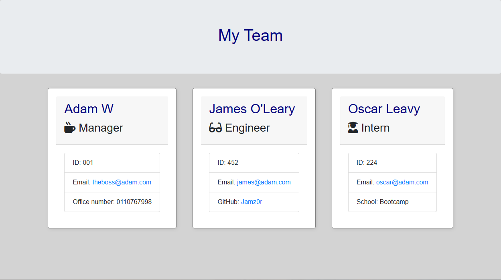

# TeamGennie

  ## Description
  This is a Command Line Application for generating a team profile. The user will be prompted to enter information about each team member, including their name, ID number, email address, role, and role-specific information. The application will then generate an HTML file that displays all the team members' information. 

## Getting Started

These instructions will get you a copy of the project up and running on your local machine for development and testing purposes. 

### Prerequisites

To run this application, you will need to have `Node.js` installed on your machine. 

### Installing

* `Clone` the repository to your local machine
* To install the necessary dependencies, run the following command in your terminal: `npm install`

### Running the Application

To run the application, use the following command in your terminal: `node index.js`

This will start the application and prompt the user to enter information about each team member. The user can add as many team members as they need, including engineers and interns. When the user is finished adding team members, they will be asked if they want to add any more. If they choose not to, the application will generate an HTML file in the `output` folder that displays all the team members' information. 

## Running the Tests

To run the tests, use the following command in your terminal: `npm run test`

## Built With

* [Node.js](https://nodejs.org/en/)
* [Inquirer](https://www.npmjs.com/package/inquirer)
* [Jest](https://jestjs.io/)

## screenshot of outful file once generated: 

